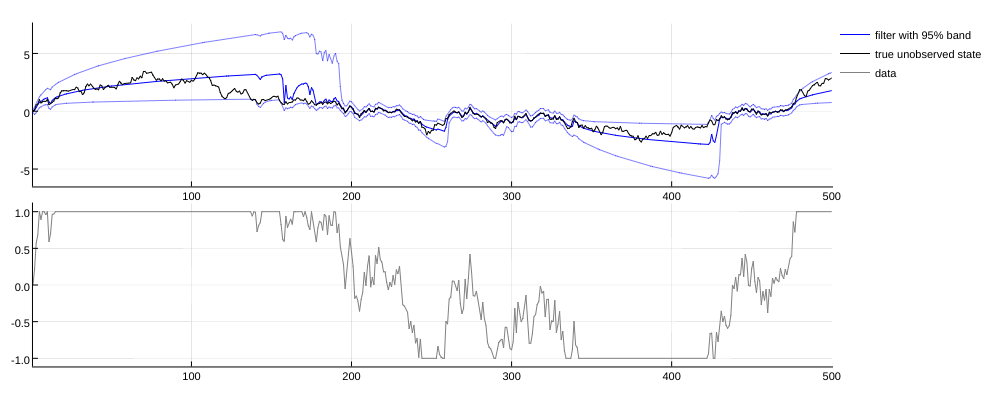

# HiddenMarkovModels.jl

A Julia package for probability and statistics with hidden Markov models.

As a simple illustration, suppose an unobserved variable `x_t` evolves as a relatively persistent AR(1), and we observe `y_t = censor(x_t + noise)` where `censor(x)` is =-1 if `x<-1`, `=x` if `-1<x<1` and =1 if `x>1`. We can track our best guess of where `x_t` is as `y_t` evolves through time by using the `filtr()` method of the package (plotted below for one particular time-series realization). When `y_t` stays out of the [-1,1] observation window for a long period of time, the uncertainty as to the position of `x_t` increases quickly, as witnessed by the width of the 95\% probability interval. When `y_t` finally falls back inside the [-1,1] observation window, our best guess gets much better, similar to what a Kalman filter would tell us for a non-censore version of this AR(1) + noise.

_nonlinear filtering for a censored AR(1) model_  

As of 10/2017, the package implements:
- A fairly complete set of methods for working with discrete hidden Markov models: filtering, smoothing, Viterbi smoothing, likelihood evaluations, maximum likelihood estimation via closed-form EM (aka. the Baum-Welch algorithm), . 
- Basic Kalman filtering for linear Gaussian hidden Markov models: filtering, smoothing.
- Proof-of-concept nonlinear filtering via kernel filtering.

The tentative scope of the package includes:
- simulation, filtering / smoothing, latent state inference, likelihood evaluations, EM-algorithm helpers.
- any type of hidden Markov models: discrete / continuous, linear / nonlinear, with / without feedback. 

Out-of-scope are:
- parameter estimation, ie. likelihood _maximization_. The package does provide all the tools needed for MLE implementation using an external optimization package (including loglikelihood evaluations compatible with automatic differentiation), but in order to keep the package focused and a lean REQUIRE file, we leave this responsibility to the user. 
- so-called nonhomogeneous models (eg. Kalman filtering with time-dependent parameters).
- control variables.

I don't have as much time as I would like for maintaining the package. If you may be interested in (paid) work on this package, please don't hesitate to get in touch.

## Usage

The package is organized around implicit interfaces:
- the package defines abstract types such as `StrictHMM` and implements generic methods such as `filtr(model::StrictHMM,initial,data,technique::FilteringTechnique)`. 
- the generic methods will in turn rely on the user's implementation of suitable model-specific methods, such as one-step-ahead simulations or density evaluations.

| Models              | Sampling | Filtering         | Smoothing | loglikelihood  | Viterbi | E-step weights |
| ------------------- | -------- | ----------------- | --------- | -------------- | ------- | -------------- |
| DiscreteHMM         | X        | X                 | X         | X              | X       | X              |
| LinearGaussianHMM   | X        | X                 | X         |                |         |                |
| StrictHMM           | X        | kernel filtering  |           |                |         |                |

## Author

Benjamin Connault

