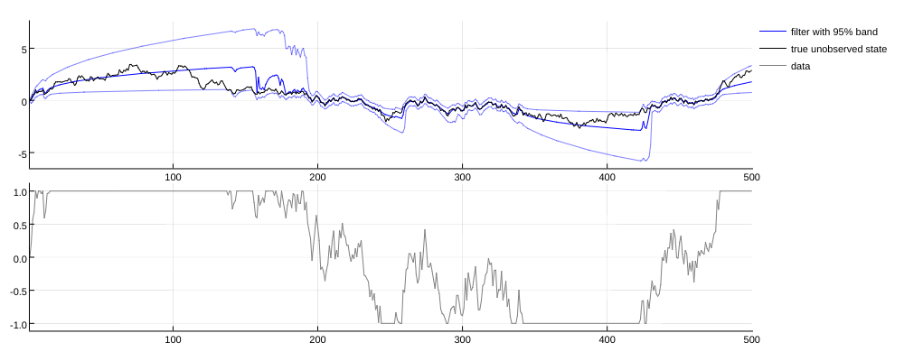

# HiddenMarkovModels.jl

A Julia package for probability and statistics with hidden Markov models.

## Illustration

Suppose an unobserved variable `x_t` evolves as a relatively persistent AR(1), and we observe `y_t = censor(x_t + noise)` where `censor(x)=-1.*(x<-1) + x*(-1<=x<1) + 1.*(1<=x)`. We can track our best guess of where `x_t` is as `y_t` evolves through time by using the `filtr()` method of the package (plotted below for one particular time-series realization). When `y_t` stays out of the [-1,1] observation window for a long period of time, uncertainty about to the position of `x_t` increases quickly, as witnessed by the width of the 95\% probability interval. When `y_t` finally falls back inside the [-1,1] observation window, our best guess gets much better, similar to what a Kalman filter would tell us for a non-censored version of this AR(1) + noise. 

One-step-ahead simulation code, ie. code that draws random `(x_{t+1},y_{t+1})` values for given `(x_t,y_t)` values, was the only example-specific code needed to compute the nonlinear filters and smoothers plotted here. See below for actual code.

## Package scope

| Models              | Sampling | Filtering         | Smoothing | Likelihood     | Viterbi | E-step weights |
| ------------------- | -------- | ----------------- | --------- | -------------- | ------- | -------------- |
| DiscreteHMM         | X        | X                 | X         | X              | X       | X              |
| LinearGaussianHMM   | X        | X                 | X         |                |         |                |
| StrictHMM           | X        | kernel filtering  |           |                |         |                |

As of 10/2017, the package implements:
- A fairly complete set of methods for working with discrete hidden Markov models: filtering, smoothing, Viterbi smoothing, likelihood evaluations, EM-algorithm helpers (computation of the E-step weights).
- Basic Kalman filtering for linear Gaussian hidden Markov models: filtering, smoothing.
- Nonlinear filtering via kernel filtering.

The tentative scope of the package includes:
- simulation, filtering / smoothing, latent state inference, likelihood evaluations, EM-algorithm helpers.
- any type of hidden Markov models: discrete / continuous, linear / nonlinear, with / without feedback. 

The following items are out-of-scope:
- parameter estimation, ie. likelihood _maximization_. The package does provide all the tools needed for MLE using an external optimization package (including loglikelihood evaluations compatible with automatic differentiation), but in order to keep the package focused and a lean REQUIRE file, we leave this responsibility to the user. 
- so-called nonhomogeneous models, aka. models with time-dependent parameters.
- control variables.

I don't have as much time as I would like for maintaining the package. If you may be interested in (paid) work on this package, please don't hesitate to get in touch.

## Usage

The package is organized around implicit interfaces:
- the package defines abstract types such as `StrictHMM` and implements generic methods such as `filtr(model::StrictHMM,initial,data,technique::FilteringTechnique)`. 
- the generic methods will in turn rely on the user's implementation of suitable model-specific methods, such as one-step-ahead simulations or density evaluations.

The file `/examples/readme-example.jl` contains the code to reproduce the picture above. First load the package and define some constants:

~~~julia 

using HiddenMarkovModels
HMM=HiddenMarkovModels
rho = 0.999
censor(x) =  min(max(-1,x),1)

~~~   

Then implement a concrete type for your model. All we need is to tell Julia how to draw random `(x_{t+1},y_{t+1})` values given some `(x_t,y_t)` values. Here `x_t` evolves as an AR(1) with N(0,0.2) innovations and `y_t` is a censored version of `x_t + N(0,0.2)`:

~~~julia
struct TAR <: HMM.StrictHMM end
HMM.draw_x(m::TAR,x) = [rho*x[1]+0.2*randn()]
HMM.draw_y(m::TAR,x) = [censor(x[1]+0.2*rand())]
~~~

Draw a time-series of unobserved and observed variables:

~~~julia
x0  = 0.0
y0  = 0.0
ini = ([x0],[y0])
T     = 500
xx,yy = rand(tar_model,ini,T)
~~~

Finally tell Julia to compute the nonlinear filter based on the time-series `y_{1:T}` using kernel filtering. We need to pass (1) a grid of `x` values and a grid of `y` values that cover well the region explored by the (joint) chain (2) an initial value for the nonlinear filter ``p(x_1|y_1)`` (here we pass the point mass at `x0`):

~~~julia
bxx = [[x] for x=linspace(-10,10,100)]
byy = [[y] for y=linspace(-10,10,100)]
kf  = KKF(tar_model,bxx,byy)
ini = [ [x0] ]
nl_filter=filtr(tar_model,ini,yy,kf)
~~~

Under the hood, Julia:
- simulated many time-series of `(x,y)`'s according to the model.
- used those simulations to build an approximation of the dynamics.
- used this approximation to compute an approximate nonlinear filter.

The numerical error in the computation of the nonlinear filter is guaranteed to go to zero with more computational time.

## Author

Benjamin Connault

